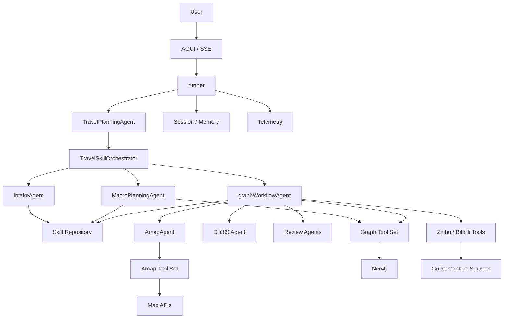

# V3 新人课程导读

这是一份面向新人 Agent 工程化入门的课程导读。我们希望用一个真实、完整、可扩展的项目案例，帮你把 Agent 开发从“会调用模型”推进到“能搭系统、能做工程”的层面。

一句话定位：

这是一个基于 `trpc-agent-go + Neo4j + workflow orchestration` 的多阶段旅行规划 Agent，用来演示一个真实 Agent 系统如何从需求理解、状态管理、工具调用、图存储到最终输出完整落地。

## 这门课想解决什么问题

我们发现很多新人接触 Agent 开发时，第一反应是“写 prompt、接模型、调工具”。这当然是起点，但真正的工程难点通常不在这里，而在下面这些问题：

- 用户需求不完整时，谁负责追问，谁负责推进阶段。
- 多个 Agent 和多个 Tool 同时存在时，如何避免互相越权。
- 生成结果很长、流程很复杂时，状态应该放在哪里。
- 为什么同样是“检索增强”，有的项目最后还是一团上下文泥球。
- 怎么把“能跑起来”变成“新人能读懂、能扩展、能复用”的工程资产。

这也是我们把 V3 做成课程案例的原因：它把这些问题都摆在台面上，而且代码里有相对清晰的落地答案。

## 为什么适合新人学

这套项目很适合作为新人入门 Agent 工程化的第一门课，因为它不是只讲单点技巧，而是把一个完整系统拆成了新人能理解的几个层次：

- `skill`：负责规则、协议、提示模板和边界说明。
- `tool`：负责真实可执行能力，输入输出结构化。
- `workflow`：负责阶段推进，不把流程控制权完全交给 LLM。
- `agent team`：负责能力分工，让地图、地理背景、审查各司其职。
- `graph state`：负责把规划结果变成可查询、可增量更新、可复审的状态图。
- `review`：负责把“生成”与“检查”拆开，形成工程闭环。
- `streaming output`：负责把最终结果以流式方式对外输出，而不是一次性闷出来。

换句话说，这门课不是教“如何写一个会聊天的 Agent”，而是教“如何搭一个能长期维护的 Agent 系统”。

## 学完以后你能掌握什么

- 看懂一个 `trpc-agent-go` 项目的主执行链路。
- 理解 skill 和 tool 的契约边界，以及为什么二者不能混写。
- 理解 Go 层 orchestrator 和 LLM 层 planner 的职责分离。
- 知道什么时候该上图数据库，而不是把所有状态塞回对话上下文。
- 理解检索增强架构在业务项目里怎么落地，不把它误解成“只要接向量库就行”。
- 学会给 Agent 项目补审查层、追踪层、回放层，而不是只堆功能。

## 90 秒面试版介绍

下面这段可以直接拿去讲，适合项目介绍、课程宣讲或者技术答辩的开场：

> 这个项目本质上是一个基于 `trpc-agent-go` 的多阶段旅行规划 Agent，但我把它设计成了一个适合新人学习 Agent 工程化的案例。它不是单个大 prompt 调几个工具，而是把系统拆成了 skill、tool、agent、workflow、graph state 几层。  
>  
> 用户请求进来以后，不是直接让模型自由发挥，而是先经过 `TravelSkillOrchestrator` 做需求准入和阶段推进，再进入宏观规划、图拆分、逐日展开、审查和最终输出。  
>  
> 这个项目最核心的难点有两个：第一，长链路任务不能只靠上下文硬撑，所以我把规划状态沉到 Neo4j 里，用 `TripPlan -> Phase -> Month -> Week -> Day -> POI/Route/Review` 这条层级链做状态载体；第二，流程控制不能完全放给 LLM，所以我把阶段推进、ID 所有权、校验和 truth source 放在 Go 层。  
>  
> 在能力层面，`trpc-agent-go` 帮我承接了 agent、team、runner、skill、tool、AGUI 和 telemetry 这些基础设施；在业务层面，我再补上地图 Agent、地理背景 Agent、审查 Agent 和图工具。  
>  
> 最终这个项目既能当业务 Agent，也能当一个新人理解 Agent 工程化落地方式的课程案例，因为它把 prompt 之外最关键的工程问题都公开了。

## 什么是 `trpc-agent-go`

在正式看项目之前，先用一句话认识一下这个框架：

`trpc-agent-go` 是一个由腾讯技术团队开源，面向 Go 生态的 Agent 开发框架，它封装了构建 Agent 系统全套功能，比如 Agent 定义、运行时管理、多 Agent 协作、Skill 加载、Tool 调用、流式输出、会话记忆和可观测性。

如果把 Agent 项目比作一套应用系统，那 `trpc-agent-go` 更像“底座”和“骨架”，它解决的是这些通用问题：

- 怎么定义一个 Agent，而不是只拼一段模型请求。
- 怎么组织多个 Agent 协作，而不是所有职责全塞给一个 Agent。
- 怎么把 Tool 和 Skill 接进运行时。
- 怎么处理会话、记忆、流式输出和 trace。
- 怎么让 Agent 项目最终像一个服务，而不是一个脚本。

它不直接替你完成业务规划，也不会自动替你设计 workflow、图模型或审查体系。真正的业务分层、领域建模和工程规范，还是要由项目自己补上。也正因为这样，它非常适合作为课程里的框架底座：新人可以先理解共性能力，再去看业务层是如何在上面搭出来的。

## tRPC 在这里做了什么

这里重点讲的是 `trpc-agent-go` 在项目里的落地角色，而不是泛泛地讲 RPC 框架。

| 组件 | 在本项目里的职责 |
|------|------------------|
| `llmagent` | 定义具体 Agent，比如 `TravelPlanningAgent`、`AmapAgent`、`Dili360Agent`、审查 Agent。 |
| `builtin planner` | 给 Agent 提供规划式思考模式，让模型按步骤决定如何调用 skill 和 tool。 |
| `team` | 把多个专职 Agent 组织成一个协作单元，而不是让单 Agent 承担所有任务。 |
| `runner` | 承接一次完整运行，把 Agent、session、memory、streaming 生命周期串起来。 |
| `agui` | 提供 AG-UI / SSE 对外入口，让请求和结果可以流式返回。 |
| `skill` | 从 `skills/` 目录加载技能仓库，让文档型规则和协议进入 Agent 上下文。 |
| `session / memory` | 提供会话和记忆能力，避免每轮都从零开始。 |
| `telemetry` | 在 `main.go` 中接 OpenTelemetry，把 metric 和 trace 打出去，方便观测。 |

可以把它理解成：`trpc-agent-go` 负责“Agent 基础设施底座”，而业务代码负责“把这个底座变成一个具体的规划系统”。

## 总架构图

## 为什么它适合作为入门 Agent 课程

这套项目最适合做新人课程的地方，在于它覆盖了 prompt 之外的真实工程问题：

- 阶段控制：阶段推进权只在 Go 层 orchestrator，不靠 LLM 自己决定。
- 上下文隔离：处理某一天时只读这一天的子图，不把全年数据全部塞进上下文。
- 结构化输出：skill 和 tool 都有明确的 JSON 协议，便于程序判断和追踪。
- 外部工具封装：地图、攻略、图读写能力分别封装，不把业务逻辑直接糊进 prompt。
- 状态持久化：核心规划结果进图数据库，不依赖临时上下文记忆。
- 审查与回放：生成和审核拆开，探索过程和图状态都可以留痕。

对课程来说，这样的项目有一个很大的好处：它不是只能拿来“演示”，而是可以直接作为练习和二次开发底座。

## 建议阅读顺序

1. 先看 [V3 系统讲解教程](./V3-系统讲解教程.md)，建立完整脑图。
2. 再对照 [main.go](../main.go)、[TravelPlanningAgent.go](../agent/TravelPlanningAgent.go)、[workflow_runner.go](../agent/workflow_runner.go) 走一遍主链路。
3. 最后再看样例输出和历史测试材料，理解业务结果长什么样。

## 现状与边界

- 当前文档以代码现状为主，不把项目包装成“所有能力都已经完全成熟”的状态。
- 仓库里有一些较早期的测试报告和样例文档，里面的阶段状态不一定和 V3 最新实现完全同步，阅读时以代码和本课程文档为准。
- 本项目当前更适合表述为“检索增强架构”或“图上下文检索增强”，而不是标准向量 RAG 示例。
