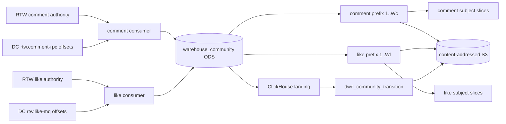

# WS07-B 评论与点赞 ODS→DWD 及覆盖交接

## 职责与边界

本切片只接纳 RTW 评论和目标点赞的事实历史，形成可重放的 PostgreSQL ODS、按 producer 分离的来源覆盖对象，以及 ClickHouse/dbt DWD 版本化 transition。它不生成 DWS 特征、样本、训练标签、曝光、未点击负例，也不修改任何推荐激活指针。



`internal/clients/ridethewind/communityauthority` 是投影中立的 authority v2 客户端。它严格读取 `{event,subject_ref,predecessor_event_id,technical_receipt,source_event_hash}`，只接受 `{issuer:"rtw.identity",subject_id:<规范正整数UID>}`，核对 DC batch 的 EventSpec JCS、input hash 和完整 receipt。该包不返回 usermodel action/predicate，也不依赖 usermodel 的历史身份结构。

`internal/warehouse/communitysource` 自己解析 RTW `rtw.community-fact.v1` payload，要求 `target_revision` 与业务 `aggregate_version` 两个键显式为 `null`、`revision_status=unknown`；评论还要求显式 `search_evidence=false`。新表只保存 `issuer + subject_id`，没有额外身份分区列。

## 两个独立来源序列

| producer | consumer | 本次 prefix | DWD 接纳范围 |
| --- | --- | --- | --- |
| `rtw.comment-rpc` | `btw-warehouse-comment` | `1..4` | create、delete、comment interaction |
| `rtw.like-mq` | `btw-warehouse-like` | `1..2` | target like、unlike |

`consumer_cursor` 的主键是 `(consumer,producer)`。每批先逐事件读取 DC receipt 与 RTW authority，再在同一 PG 事务写 `ods_event`、`read_batch_evidence` 和 cursor；事务提交后才 ACK。ACK 响应丢失时，下次按 **DC 当前返回的窗口和 batch hash** 读取，已落 ODS 的 offset/event ID/hash/receipt ID 必须原值重放，新 offset 继续顺序落库。新的真实窗口可以比上次更长或更短；`read_batch_evidence` 以 `(consumer,producer,from_offset,to_offset,batch_hash)` 保存每一次窗口，不强制同一个起始 offset 永远对应同一个窗口。缺 offset、错 hash、错 authority 或找不到同主体、目标、评论的前驱都会回滚整批且不 ACK。

`ods_event` 和 `read_batch_evidence` 有数据库触发器拒绝 UPDATE/DELETE。RTW issuer 与规范正整数 subject ID 同时由 Go 和 PG CHECK 约束。原 EventSpec 与完整技术回执保存为 JSONB；DWD 只取可审计的领域字段，不把 source offset 当成主体内连续序列。

## 覆盖对象与交接

`CoveragePublisher.Publish` 一次只接收一个固定 `Stream`。它在 repeatable-read 快照里要求 ODS 恰好覆盖 `1..W`，审计每个已保存窗口的原始 DC batch hash，再从可重叠的窗口中确定性选一条从 1 连续到 W 的批次证据链；W 必须是其中一个真实批次边界。已保存的其他窗口仍是不可变读取证据，**batch hash 不充当业务水位**。发布前再次读取每条 DC receipt 和 RTW authority。

每个 producer 独立写入以下内容寻址对象：

- `event-index/*.jsonl`：完整 `1..W`，包含 EventSpec、receipt、v2 SubjectRef 与前驱；
- `batch-evidence/*.jsonl`：真实读取窗口及 DC batch hash；
- `prefix-manifest/*.json`：只指向同一 producer 的 index 与 batch chain；
- `subject-index/*.jsonl`：从完整 prefix 派生的主体稀疏切片；
- `subject-receipt/*.json`：把主体切片绑定到 prefix manifest hash。

评论和点赞的 offset 1 是两个不同来源位置，不能拼成一条 `1..6` 序列，也不能用一个 producer 的主体切片证明另一个 producer 的覆盖。

## DWD 合同

`warehouse/community/models/dwd_community_transition.sql` 输出 `source_version`、`operation`、`transition_type`、old/new state、前驱、主体、目标和三种来源时间。此次真实数据的 transition 依次为：

- comment：`comment_create`、`comment_like`、`comment_unlike`、`comment_delete`；
- like：`target_like`、`target_unlike`。

四个 dbt data test 检查来源精度、支持的 transition、前驱一致性和 `(producer,source_offset)` 唯一性。DWD schema 明确不存在身份额外分区、impression、label、sample 或 content revision 列。

## 2026-09-15 同次本机验收

命令入口为 `warehouse/community/acceptance.sh`。脚本要求显式提供被审核的 DC/RTW 完整提交 SHA，并在启动任何服务前核对工作树 HEAD；它使用锁定的 ClickHouse、SeaweedFS 与 dbt 运行时。

本次验收固定：

- DataCenter：`5702d3b22ccde706cc9e5661cc0aaee0514acf3a`；
- RideTheWind：`7cfefd794b1ee6b203c5b177656a4293dea571c7`；
- BreakTheWaves 运行代码：`e7e8260d952c538c326a4bdc8b511d1ff66945a0`；
- 证据目录：`/var/folders/f_/l5hv3b1d6sx8zwr_cc8fkjkm0000gn/T/sea-community-warehouse.7VZcG0/runtime-evidence`；
- 报告 SHA-256：`23e16d4ea582d29a54395ddc6acc77f0a9f5dba1975ba85154e846b564345dd1`；
- ODS SHA-256：`8d9ca1ce6f3dcc30e3f31a0aad678ccbb08d8052cd8bd683e5867a9bbd0be22f`；
- DWD SHA-256：`62e7bfa9a3788d07481aea6c337a5e11b9b0d97231c4f0f6654db69a8520354f`；
- dbt manifest：`4a58054578fdc54a44982a4a2e6e81139881828345c8257e47f1fcd4d66173be`；
- dbt run results：`9e5500369a12b18c426d65fed09594108b73cf5b02eeccbe8017d0191a72856b`。

真实链由 RTW 业务事务产生六条事实，经正式 dispatcher 到 DC，再由两个 warehouse consumer 写 PG。测试故意执行错 authority、错 hash、错前驱、缺 offset 四种拒收，并让两个 producer 的首次 ACK 响应丢失后重启；随后发布 comment `1..4`、like `1..2` 两份 prefix 和三份主体 receipt。真实 ClickHouse/dbt 执行结果为 `PASS=5`，ODS、DWD 和全部覆盖对象均写入同次 SeaweedFS 并按内容 hash 回读。

本项状态为 `LOCAL_VERIFIED`。未验证真实 Kafka/Redis、长期常驻调度、线上数据库、生产对象存储、DWS 特征、样本、训练、模型效果或推荐激活。下游接手时必须分别绑定两个 prefix manifest，并把这些 transition 当作领域事实历史；任何更高层含义都需要新的、独立验收来源。

运行示例：

```sh
SEA_DC_PLATFORM_ROOT=/path/to/datacenter \
SEA_RTW_COMMUNITY_ROOT=/path/to/ridethewind \
SEA_COMMUNITY_WAREHOUSE_RUNTIME=/path/to/locked-runtime \
SEA_COMMUNITY_EXPECTED_DC_SHA=<40位提交> \
SEA_COMMUNITY_EXPECTED_RTW_SHA=<40位提交> \
bash warehouse/community/acceptance.sh
```
